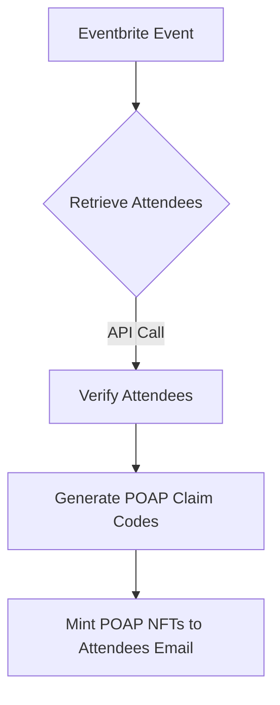

# 🚀 EventSync: Autonomous Web2 & Web3 Event Management Agent

## 🏆 Gaia Autonomous Hackathon Submission
### Agent Integrations Track | Coinbase Developer Platform Bounty


## 🌐 Project Overview

**EventSync** is a groundbreaking AI agent that seamlessly bridges Web2 and Web3 event ecosystems, leveraging the Coinbase Developer Platform's AgentKit to create a fully autonomous event management solution.

### 🔑 Key Innovations

- **Autonomous Event Integration**: Intelligently connects Eventbrite (Web2) with POAP (Web3)
- **Frictionless Onboarding**: Mints POAP NFTs directly to attendee email addresses
- **Web3 Accessibility**: Removes wallet complexity for new blockchain users
- **AI-Powered Event Management**: Uses advanced AI agents to handle event logistics

## 🛠 Technical Architecture

### Core Components
- **Coinbase Developer Platform AgentKit**: Primary framework for agent development
- **Eventbrite API**: Event and attendee management
- **POAP API**: Decentralized proof-of-attendance NFT minting
- **LangChain & LangGraph**: Powering intelligent agent interactions

### Unique Technical Features

1. **Multi-API Integration**
   - Dynamically retrieves event details from Eventbrite
   - Fetches and manages POAP claim codes
   - Autonomously mints NFTs to verified attendees

2. **Wallet-Less NFT Distribution**
   - Email-based POAP minting
   - Removes blockchain entry barriers
   - Enables Web3 participation for non-crypto users

3. **Autonomous Agent Capabilities**
   - Can operate in chat or fully autonomous modes
   - Dynamically selects and executes blockchain actions
   - Adaptable to various event management scenarios

## 🔗 Agent Workflow



## 💡 Coinbase Developer Platform Bounty Alignment

### Criteria Fulfillment
- ✅ Uses AgentKit as primary driver for onchain transactions
- ✅ End-user focused application
- ✅ Seamless Web2 and Web3 functionality
- ✅ Enables significant agent autonomy

## 🚀 Getting Started

### Prerequisites
- Coinbase Developer Platform account
- Eventbrite API credentials
- POAP API access

### Installation

```bash
git clone https://github.com/ofemeteng/eventsync-agent.git
cd eventsync-agent
pipx install poetry
poetry install
```

### Configuration

Create a `.env` file with the following:
```
EVENTBRITE_API_KEY=your_eventbrite_key
POAP_API_KEY=your_poap_api_key
POAP_ACCESS_TOKEN=your_poap_access_token
CDP_API_KEY_NAME=your_cdp_api_key_name
CDP_API_KEY_PRIVATE_KEY=your_cdp_api_key_private_key
```

### Running the Agent

```bash
poetry shell
python agent.py
```

Choose between:
- `chat`: Interactive mode
- `auto`: Autonomous action mode

## 🌟 Future Roadmap

- [ ] Support for multiple event platforms
- [ ] Advanced attendee analytics
- [ ] Cross-platform event credential verification
- [ ] Machine learning-powered event recommendations

## 🤝 Contributing

Interested in improving EventSync? We welcome contributions!

1. Fork the repository
2. Create your feature branch
3. Commit your changes
4. Push to the branch
5. Create a new Pull Request

## 📄 License

MIT License - Empowering autonomous event management worldwide.

---

### 🏅 Hackathon Impact

EventSync demonstrates the transformative potential of AI agents in bridging digital ecosystems, making blockchain technologies more accessible and user-friendly.

**Built with 💖 for the Gaia Autonomous Hackathon**