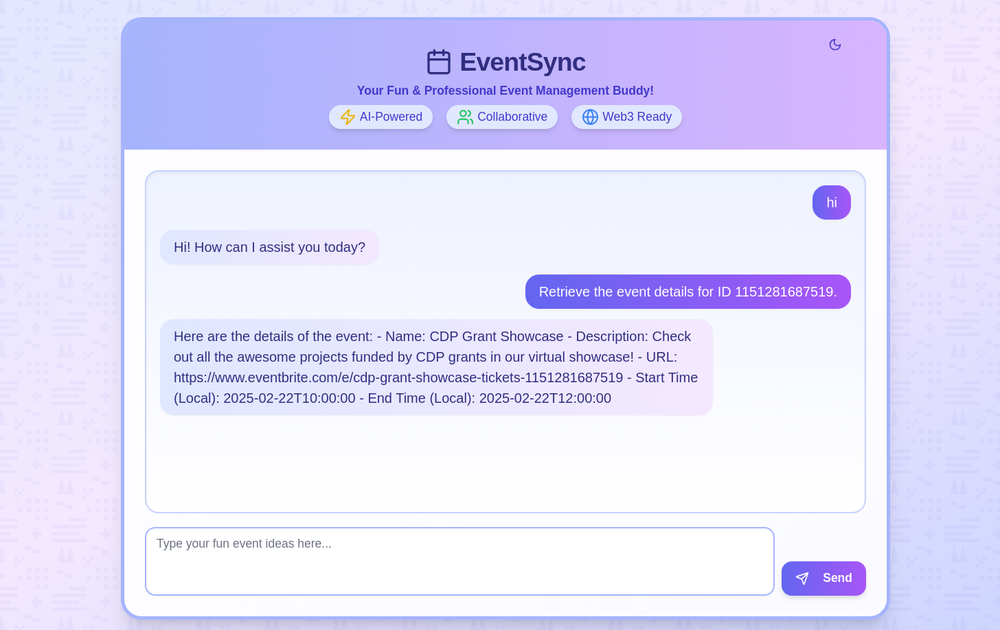
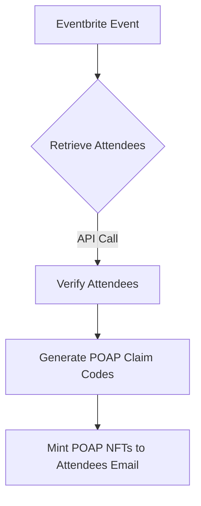

# 🚀 EventSync: The Ultimate Web2 & Web3 Event Management Agent

## 🏆 Round 3 CDP Builder Grants Submission | AgentKit Edition
*Building on our success as one of the winners of the Best CDP AgentKit Integration (Coinbase Developer Platform Bounty) at the [Gaia Autonomous Hackathon (December 2024)](https://www.gaianet.ai/blog/gaia-first-autonomous-hackathon)*



## 🌟 What's New

EventSync has evolved significantly since its hackathon debut, with major improvements including:
- 🎨 Brand new sleek frontend interface ([EventSync Frontend](https://github.com/ofemeteng/eventsync-frontend))
- 🛠 Expanded toolkit with new AgentKit actions
- 🤖 Enhanced autonomous capabilities
- 🔄 Seamless Web2 to Web3 integration

## 🎯 Project Overview

**EventSync** is a groundbreaking AI agent that seamlessly bridges Web2 and Web3 event ecosystems, leveraging the [Coinbase Developer Platform's AgentKit](https://docs.cdp.coinbase.com/agentkit/docs/welcome), [Proof of Attendance Protocol (POAP) NFTs](https://poap.xyz) and [Eventbrite](https://www.eventbrite.com) to create a fully autonomous event management solution.

### 🔑 Key Innovations

- **Autonomous Event Integration**: Intelligently connects Eventbrite (Web2) with POAP (Web3)
- **Frictionless Onboarding**: Mints POAP NFTs directly to attendee email addresses
- **Web3 Accessibility**: Removes wallet complexity for new blockchain users
- **AI-Powered Event Management**: Uses advanced AI agents to handle event logistics

## 🛠 Technical Architecture

### Core Components
- **Coinbase Developer Platform AgentKit**: Primary framework for agent development
- **Eventbrite API**: Event and attendee management
- **POAP API**: Decentralized proof-of-attendance NFT minting
- **LangChain & LangGraph**: Powering intelligent agent interactions

### 🔑 Why EventSync Stands Out

1. **End-User Focused**
   - No crypto wallet required
   - Email-based NFT distribution
   - Familiar Web2 interface for Web3 actions

2. **Comprehensive Event Management**
   - Create and manage Eventbrite events
   - Automatic POAP NFT minting
   - Attendee tracking and verification

3. **AgentKit Integration**
   - Custom actions for event management
   - Autonomous decision-making
   - Seamless blockchain interactions

### Available Agent Tools
```python
- createEventbriteTool # Create new events
- retrieveEventTool     # Fetch event details
- listAttendeesTool     # Get event attendees
- getClaimCodesTool     # Generate POAP claim codes
- getClaimSecretTool    # Manage claim secrets
- mintPoapTool         # Mint POAPs for attendees
```

### Agent Workflow



## 💫 Key Features

### For Event Organizers
- One-click event creation
- Automatic POAP distribution
- Attendee management
- Real-time event analytics

### For Attendees
- Seamless NFT claiming
- No crypto knowledge required
- Email-based verification
- Digital proof of attendance

## 🚀 Getting Started

### Prerequisites
```bash
- Coinbase Developer Platform account
- Eventbrite API credentials
- POAP API access
```

### Installation

```bash
# Clone the repositories
git clone https://github.com/ofemeteng/eventsync-agent.git
git clone https://github.com/ofemeteng/eventsync-frontend.git

# Backend setup
cd eventsync-agent
pipx install poetry
poetry install

# Frontend setup
cd ../eventsync-frontend
npm install
```

### Configuration

Create separate `.env` files for the backend and frontend:
```env
# Backend
EVENTBRITE_OAUTH_TOKEN=your_eventbrite_oauth_token
POAP_API_KEY=your_poap_api_key
POAP_ACCESS_TOKEN=your_poap_access_token
CDP_API_KEY_NAME=your_cdp_api_key_name
CDP_API_KEY_PRIVATE_KEY=your_cdp_api_key_private_key
POAP_CLIENT_ID=your_poap_client_id
POAP_CLIENT_SECRET=your_poap_client_secret

#Frontend
NEXT_PUBLIC_API_BASE_URL=the_base_url_of_the_eventsync_backend_agent
```

### Running the Application

```bash
# Backend
poetry shell
uvicorn server:app --reload

# Frontend
npm run dev
```

## 🎯 CDP Builder Grants Alignment

EventSync perfectly aligns with Round 3's focus on AgentKit implementations by:
- ✅ Creating new, reusable AgentKit actions
- ✅ Delivering an end-user facing application
- ✅ Integrating Web2 and Web3 seamlessly
- ✅ Enabling autonomous event management
- ✅ Supporting ETH payments to event prize winners

## 🔮 Future Development

- [ ] AI-powered event recommendations
- [ ] Stablecoin payment integration
- [ ] Cross-platform event verification
- [ ] Advanced analytics dashboard

## 🤝 Contributing

We welcome contributions! Please follow these steps:

1. Fork the repository
2. Create your feature branch
3. Commit your changes
4. Push to the branch
5. Submit a Pull Request

## 📄 License

MIT License - See LICENSE file for details.

---

Built with 💝 using Coinbase Developer Platform's AgentKit | [Documentation](https://docs.example.com/eventsync)
